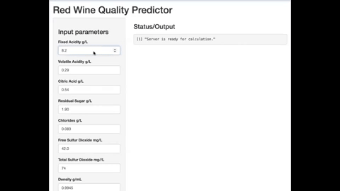

# Red Wine Quality Predictor  

Red Wine Quality Predictor was created using random forest,a machine learning model in RStudio.  To crate the GUI interface Rshiny was used. This app will generate a prediction of a red wine when parameters are entered. 

  

##  Technologies
* R
* RStudio
* Shiny
* RandomForest
* Tidyverse
* Caret
* Data Table
* Readr
* Readxl

### Red Wine Quality Predictor App Input  
 < br/>

 

### Red Wine Quality Predictor App Output  
  

