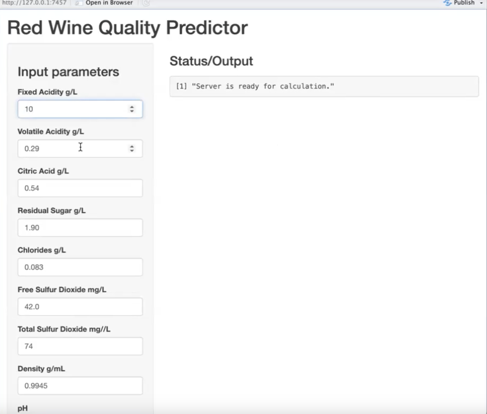
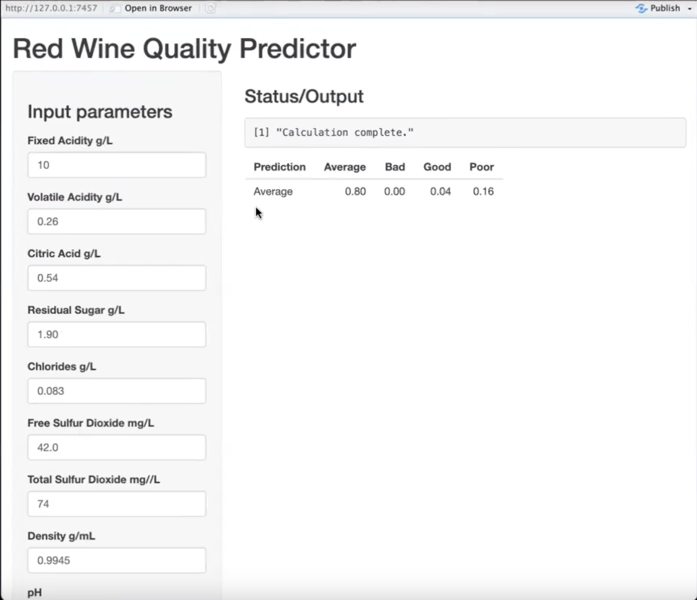

# Red Wine Quality Predictor  

Red Wine Quality Predictor was created using random forest,a machine learning model in RStudio.  To crate the GUI interface Rshiny was used. This app will generate a prediction of a red wine when parameters are entered. 

  

##  Technologies
* R
* RStudio
* Shiny
* RandomForest
* Tidyverse
* Caret
* Data Table
* Readr
* Readxl

##  Features
#### What is Random Forest 
Random Forest is an ensemble machine learning technique that combines multiple decision trees trained on different subsets of the data, with the goal of reducing the overfitting often seen in individual decision trees. In other words, it can be applied to both classification and regression tasks by constructing many trees during training and aggregating their results.

For the Red Wine Quality Prediction Project, Random Forest was selected because it effectively captures complex, non-linear relationships between chemical properties and wine quality. Since wine quality is influenced by multiple interacting factors such as alcohol content, volatile acidity, and sugar levels. Random Forest provides a more accurate and robust prediction compared to simpler models.

#### How Random Forest Works  
With Random Forest, the process begins by creating multiple bootstrapped datasets from the original data. For each dataset, a decision tree is built using a random subset of features at each split. This process is repeated across many bootstrapped samples, resulting in a "forest" of decision trees. Because the model combines many trees, it becomes more robust and less prone to overfitting.

The model’s performance is evaluated using the out-of-bag (OOB) data, which refers to the samples not included in each bootstrapped dataset. When new data is introduced, it is passed through all the trees in the forest, and the final prediction is determined by majority voting (for classification) or averaging (for regression).
This approach—building multiple models on bootstrapped samples and then aggregating their predictions—is known as bagging (bootstrap aggregating).

#### Data Processing  
The dataset was prepared by converting numerical quality scores (0-10) into four meaningful categorical ratings and removing the original numerical column. This transformation makes the model output more interpretable for end users. The original numerical quality ratings were recoded into four categories using the mutate() and recode() functions:

 df2 <- df |>
  mutate(rating = recode(quality,         # new column called rating
                         "10" = "Excellent",			
                         "8"  = "Good",
                         "9"  = "Good",
                         "6"  = "Average",
                         "7"  = "Average",
                         "5"  = "Poor",
                         "4"  = "Poor",
                         "3"  = "Bad",
                         "2"  = "Bad",
                         "1"  = "Bad",
                         "0"  = "Bad"))

# remove quality from dataframe 
df3 <- subset(df2, select = -quality)

Missing data was not a concern for this analysis since random forest algorithms inherently handle missing values through their bootstrapping and voting mechanisms, eliminating the need for manual imputation or case deletion.

Confusion abd matrix model plot

Error Plot Interpretation:
Black line: Overall OOB error across all classes
Colored lines: Class-specific error rates (Average=cyan, Bad=green, Good=blue dashed, Poor=red)

#### Model Tuning  
* Trees (ntree): Set to 2,001 trees, though the error plot shows stabilization around * 200-300 trees, suggesting fewer trees would be sufficient. 
* Variables per split (mtry): Tested values around √11 ≈ 3.3. Tried 2, 3, and 4 variables per split, with mtry=4 yielding the lowest OOB (out-of-bag)  error rate.

#### Model Performance  
Overall OOB Error: 20.3% (407 misclassifications out of 2001 total cases)
 
The OOB error rate is calculated by comparing the OOB predictions to the actual     class labels. For classification, it is defined as the total number of misclassified OOB instances divided by the total number of training instances. A lower OOB error indicates better model performance. For regression tasks, the OOB error is typically measured using metrics such as the mean squared error (MSE).

#### Confusion Matrix Analysis:  
| Actual → | Average | Bad | Good | Poor | Class Error % |
|----------|---------|-----|------|------|---------------|
| **Average** | 547     | 0   | 13   | 115  | 18.36        |
| **Bad**     | 0       | 0   | 0    | 1    | 100.00       |
| **Good**    | 1       | 0   | 3    | 0    | 86.67        |
| **Poor**    | 122     | 8   | 0    | 472  | 19.73        |

#### Confusion Matrix Interpretation:
Rows represent predicted classes, columns represent actual (true) classes
Correct Predictions (Diagonal values - True Positives):
* Average: 547 correctly predicted
* Bad: 0 correctly predicted
* Good: 3 correctly predicted
* Poor: 472 correctly predicted
  
#### False Positives (incorrectly predicted as this class):
* Average: 1 Good + 122 Poor = 123 wines incorrectly predicted as Average
* Bad: 8 Poor wines incorrectly predicted as Bad
  
#### False Negatives (should have been predicted as this class but were not):
* Average: 13 predicted as Good + 115 predicted as Poor = 128 Average wines missed
* Bad: 1 predicted as Poor = 1 Bad wine missed

#### Key Findings  
The random forest model achieved its best performance on Average wines (81.64% accuracy) and Poor wines (80.27% accuracy), which represent the most prevalent categories in the dataset. In contrast, the model struggled significantly with Bad wines (0% accuracy) and Good wines (13.33% accuracy). This performance disparity is directly attributed to severe class imbalance, where the model performs best on the most common categories while failing to accurately classify rare wine quality levels. Both "Bad" and "Good" wines have very few examples in the dataset, making them extremely difficult to classify accurately. This severe class imbalance explains why the model struggles so much with these categories - there simply are not enough examples for the algorithm to learn their distinctive patterns effectively. While 2,001 trees were used in this model when approximately 500 would have sufficed based on the error convergence plot, overfitting is generally not a concern with random forest algorithms due to their ensemble nature and built-in regularization through bootstrap sampling and random feature selection at each split.

### Red Wine Quality Predictor App Input  
  

### Red Wine Quality Predictor App Output  
  

